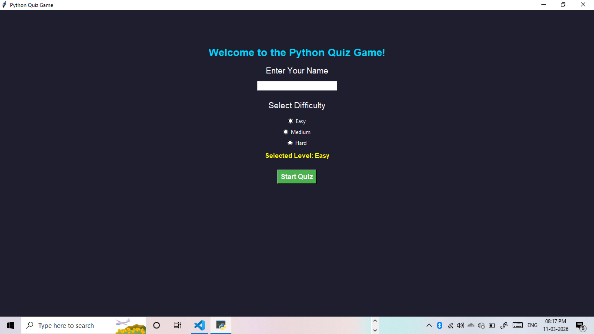

# 🧠 Python Quiz Game (GUI)

A desktop quiz application built with Python and Tkinter that tests programming knowledge through interactive multiple-choice questions.

A modern **Python GUI Quiz Application** built using Tkinter.  
This app presents multiple-choice questions with a timer, difficulty levels, and score tracking.

It is designed as a **beginner-to-intermediate Python project** to demonstrate GUI development, logic building, and user interaction.

---

## 🚀 Features

✔ Interactive GUI built using Tkinter  
✔ 30 Multiple Choice Questions  
✔ Difficulty Levels (Easy / Medium / Hard)  
✔ Timer for each question  
✔ Progress Bar Timer  
✔ Random Question Order  
✔ Score Calculation with Percentage  
✔ Clean and modern UI  
✔ Beginner-friendly project structure  

---

## 📸 Application Screenshot



---

## 🛠 Technologies Used

- Python
- Tkinter (GUI Library)
- Random Module

---

## 📂 Project Structure

```
quiz-game-python
│
├── quiz_gui.py
├── README.md
├── requirements.txt
├── scores.txt
└── quiz-app.png
```

---

## ⚙ Installation

### 1️⃣ Clone the repository
git clone https://github.com/your-username/python-quiz-game.git

### 2️⃣ Navigate to project folder
cd python-quiz-game

### 3️⃣ Install dependencies
pip install -r requirements.txt

---

## ▶ Running the Application

Run the following command:
python quiz_gui.py

The quiz application window will open.

---

## 🎮 How to Play

1. Enter your name
2. Select difficulty level
3. Click **Start Quiz**
4. Answer questions before the timer ends
5. View your final score and percentage

---

## 📊 Difficulty Levels

| Level | Timer |
|------|------|
| Easy | 30 seconds |
| Medium | 20 seconds |
| Hard | 10 seconds |

---

## 🎯 Learning Outcomes

This project demonstrates:

- Python GUI development
- Event-driven programming
- Timer implementation
- Randomized questions
- UI design principles

---

## 👩‍💻 Author

**Natani Guna Sri Durgapriya**

Aspiring Software Developer | Learning Python, AI & Data Science

---

⭐ If you like this project, consider giving it a **star on GitHub**.